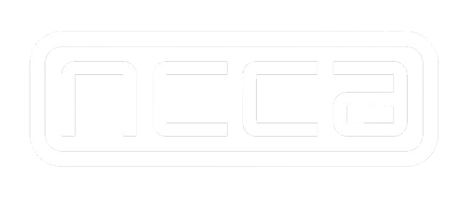

<!Doctype html>

<html width="100%" height="100%">
  <header>
  

<h1 align="center">
  Christopher Hosken | Generalist TD
</h1>

  

    
    
    
  

  </header>
  <body>

## 👋 About Me
  - 🎓 Currently studying **Computer Animation Technical Arts** at **Bournemouth University**
  - 🎨 Interested in **Open Source, artificial intelligence, web applications, and Pixar USD ecosystems**  
  - 📍 Based in **Bournemouth, UK**
  - 💻 **Looking for Pipeline, FX, RnD, or TD Roles (for July, 2026)**

  ## 🛠️ Software & Tools
  

    
    
    
    
    
    
  

   
   

    
    
    
    
    
    
    
    
    
    
    
    
    
    
    
  

   
  

    
    
    
    
    
    
    
  

  ## 🚀 Featured Projects

<table align="center">
  <tr>
    <!-- Gravi -->
    <td align="center" width="50%">
      
       
      
    </td>

  <!-- Deadshot -->
  <td align="center" width="50%">
    
       
      
    </td>
  </tr>
</table>

## 📊 Statistics & Work

  
  

  
  

</body>
</html>
