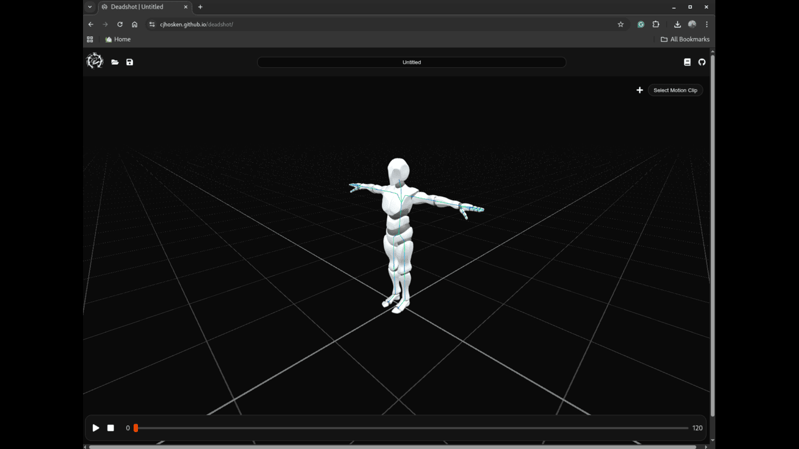

<h1 align="center">Christopher Hosken</h1>

  
  

---

Hey! I'm Christopher Hosken, a Generalist TD currently studying Computer Animation Technical Arts at Bournemouth University.

---

## 🚀 Featured Projects

<table>
  <tr>
    <td align="center" width="50%">
      <a href="https://github.com/cjhosken/gravi">
         
        
      </a>
    </td>
    <td align="center" width="50%">
      <a href="https://github.com/cjhosken/deadshot">
         
        
      </a>
    </td>
  </tr>
</table>

---

## 📊 GitHub Stats

  
  

